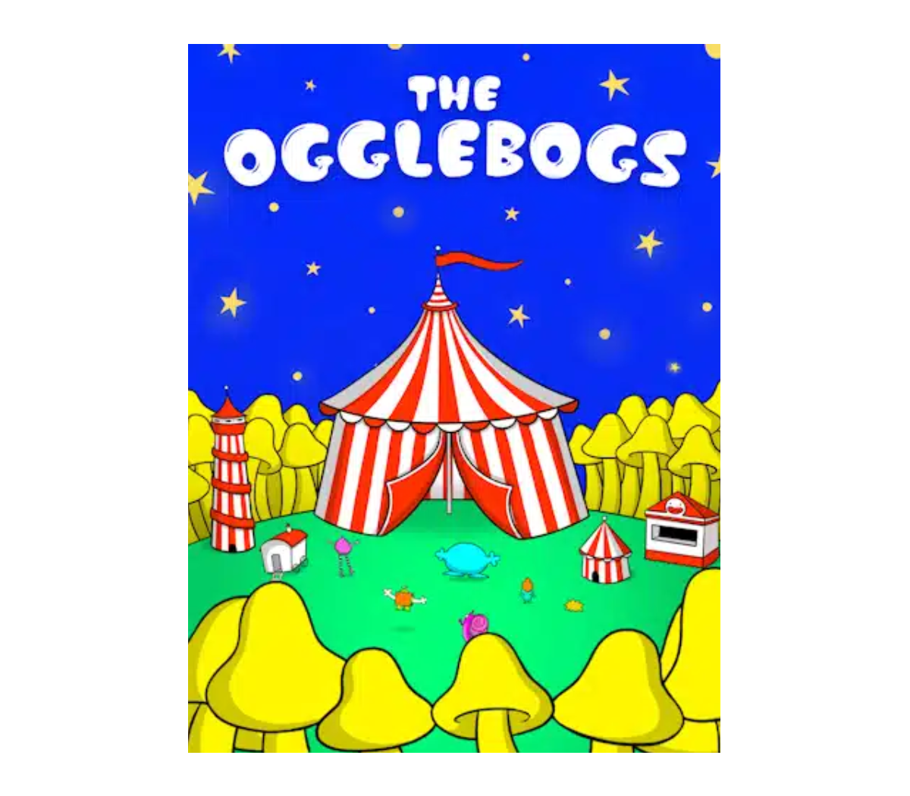

# The Ogglebogs​

#### By [Justin Spencer](about.md), 12 June 2015

Far, far away, in deepest, darkest, outer space is a very strange planet called Ogg.

In space there are stars and swirls, as well as a slimy green planet in the middle.

In the middle of the planet is a stinky, smelly, bog called the Ogg Bog. Near the bog grows Blobweed, which is a horrible plant that smells of old dogs and last week’s boiled eggs. 

And there are lots of funny little houses all around. And in those little houses live the Ogglebogs.

Now, you might well ask what in blazing bananas are Ogglebogs? Well, they are the friendliest little aliens you could ever find. Some are big, some small, some thin and some tall, some round and some fluffy.

Rocco has green skin with a white circle in the middle of this tummy, their light pink smile is wide and their orange hair rounded edges like a cloud.

One of the Ogglebogs is called Rocco, who has green skin and lovely orange hair, usually has a great big smile and is the most helpful of all Ogglebogs. But is sometimes a bit…..forgetful.

Rocco wakes up every morning then has a lovely warm bath of purple custard. Oh yes, all Ogglebogs have a bath in custard every single day and they all choose different colours. Some like a bath of warm custard and some like it cold.

Then off goes Rocco to join a whole bunch of bestest friends for breakfast at the Oggle Café. Now, the Oggle Café is at the end of the clouds with a great view of the Oggle Bubble Mountain. This is a mountain made of guess what? Yes, bubbles! And sometimes, when the wind blows, some bubbles pop and some even float away!

The cafe is a pink teapot shape and there's a purple path leading to the front door. The cafe is surrounded by bubble mountains.

I’d better tell you about Rocco’s friends. 

Blobbo is Rocco’s very bestest friend and is shaped just like a big, wobbly blue ball, with an open mouth in the middle ready to eat anything tasty that might just come along. Blobbo is usually quite tired and yawns a lot.

Then there’s Coco who is a tiny little ball of yellow fur with eight legs and has three eyes and two little noses.

And Oddo who is shaped a bit like a bright pink snail, with two little arms either side and slides along very, very slowly.

Beepo is orange and square, with a high voice, a bit like a robot.  And out of the top of Beepo’s head is an aerial and is often seen flying around with a whizzing sound.

Finally, there’s Twinko who is pink and fluffy with very long legs. So long that Twinko often trips over things.

Blobbo, Coco, Oddo, Beepo and Twinko, are all waiting at the Café for their friend Rocco so they can start to eat their very favourite breakfast of Ogglecakes.

The Ogglebogs are sat around a round lime green table with purple and green cakes in front of them. There's an oval window behind them showing the dark blue space sky and the light blue bubble mountains.

Now, Ogglecakes are very tasty and they are made from opples, plims and dotes. Yes, I did say opples, plims and dotes. They are Ogg fruits, a bit like our apples, plums and dates. But opples are square and bright blue, plims are shaped like a triangle and dotes are green with pink stripes.

A purple cake has a green icing on top, and a pink ball placed on top.

One day, as they were all finishing up their Ogglecakes, Blobbo said, “Do you still have your bath in purple custard, Rocco?”

“Oh yes, makes my skin all soft and my hair stand up just right,” replied Rocco with a great big smile. 

“Well, I need your help,” said Blobbo.

Blobbo looked sad and then said, “You see, I was in my bath this morning and suddenly felt very hungry and all of a sudden my bath custard had gone.”

Blobbo is a blue monster, he is peering over the side of a grey bathtub, his fingers holding onto the edge of the bath. His lips are covered in purple custard and he has a few purple splashes over his head.

“Blazing bananas! Gone where?” asked Twinko.

“In my tummy,” replied Blobbo, “I accidentally did one of my great big yawns and the next thing I knew I was sitting in an empty bath.”

“Oh dear, so you swallowed up all your bath custard?” asked Oddo.

“Every bit. And now there’s none left for tomorrow,” wailed Blobbo.

“Oh dear,” said Rocco, “looks like we need to take a trip to the Custard Lake today, Blobbo! I hope we are in luck because some days the custard in the lake all turns green. You don’t want a bath in green custard, do you?” 

“Oh, no, it has to be purple custard for me, and the colder the better,” answered Blobbo.

“Then, after our Ogglecakes, we can both set off for the Custard Lake. Make sure you bring a big bucket,” said Rocco.

“Big bucket? I haven’t got a big bucket,” cried Blobbo.

Rocco and Blobbo are sitting at the table with one ogglecake in front of them. They both have thought bubbles showing that they are thinking about a big bucket with purple liquid in it.

“I see. Well, that means we will have to go through the Mushmallow Forest to the Bucket Cave to get one,” said Rocco. 

“Do you think there might be Riplats in the Mushmallow Forest?” asked Blobbo, “Riplats can be a bit naughty sometimes, can’t they?”

Join us next time to find out what Riplats are and how Rocco and Blobbo get on at the Bucket Cave. 

Will there be any buckets big enough for all Blobbo’s custard?

Will the Custard Lake be the right colour?

Stay tuned for more brilliant, custardy, Ogglebog stories with Rocco and his friends on Planet Ogg. 

The End

#### © Justin Spencer 2015. For licensing opportunities, please contact j.spencer-ip@proton.me

